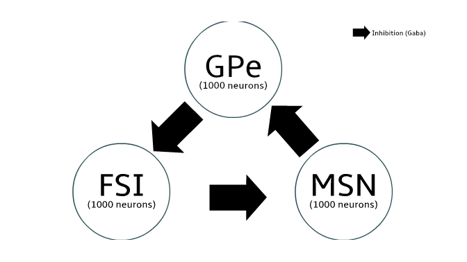

# Basal Ganglia Computational Model 2017

## 1_Modelisation of FSI, MSN and GPE neural network involved in beta-oscillations generation in Parkinson's Disease 

  
  

## 2_Modelisation of Striato-Thalamo neural network involved in beta-oscillations generation in Parkinson's Disease 

